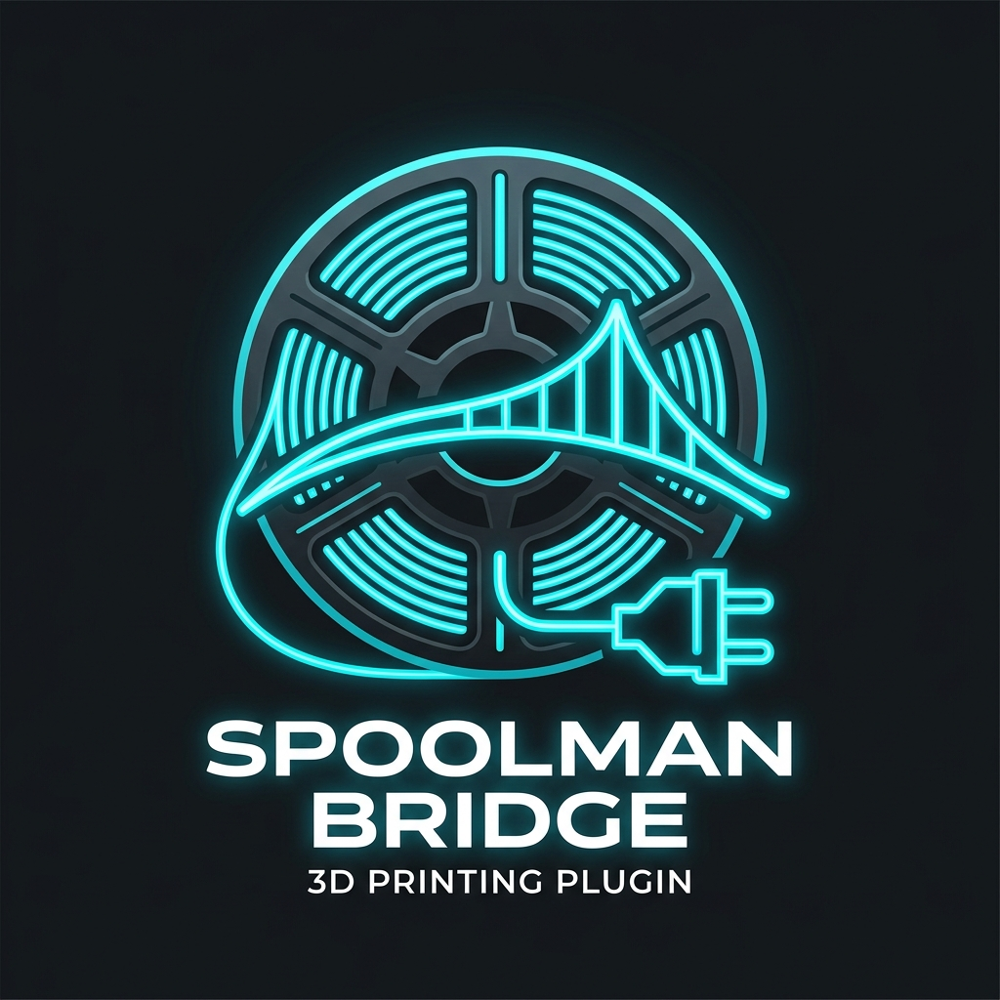
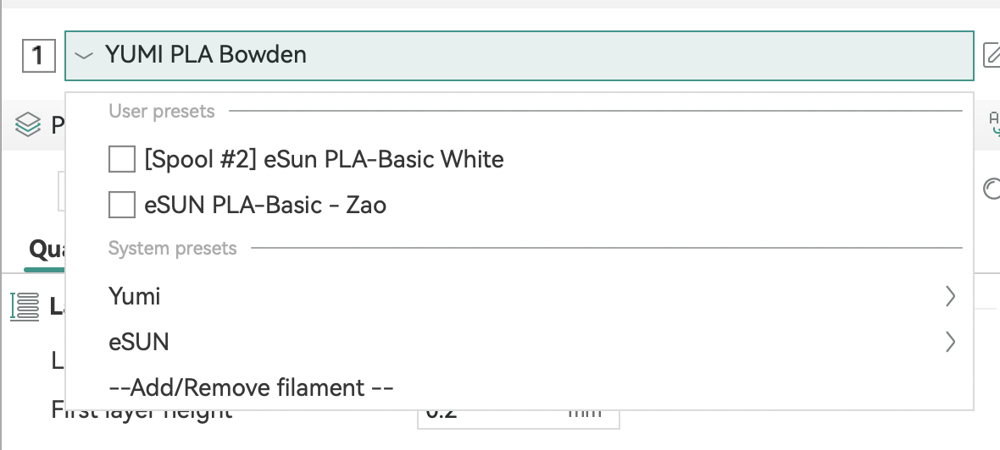
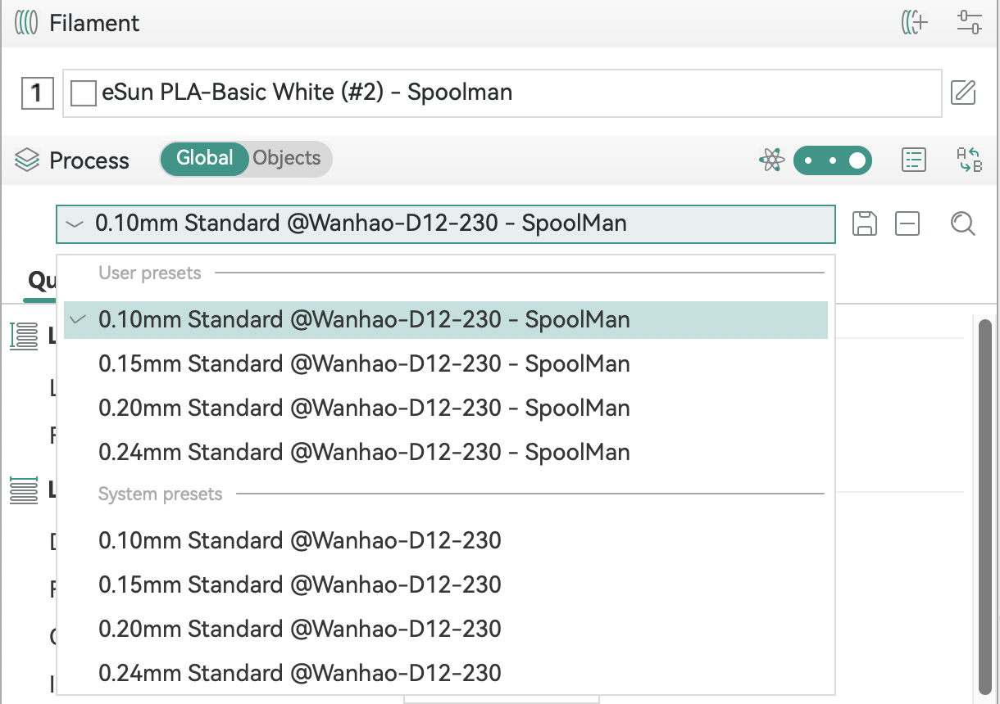
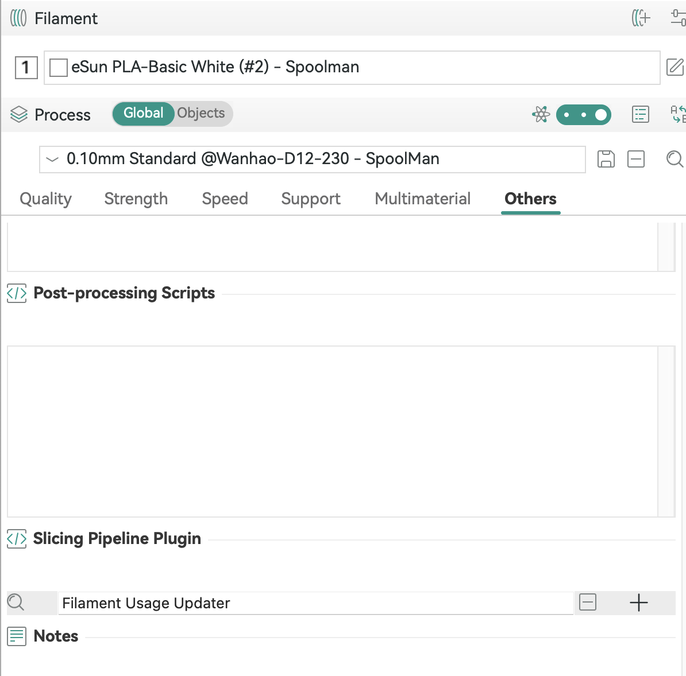
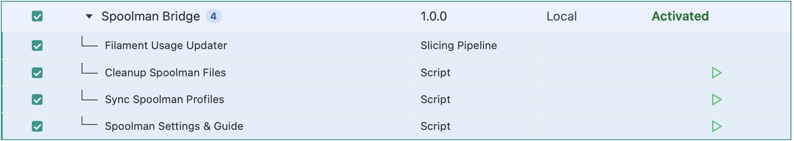
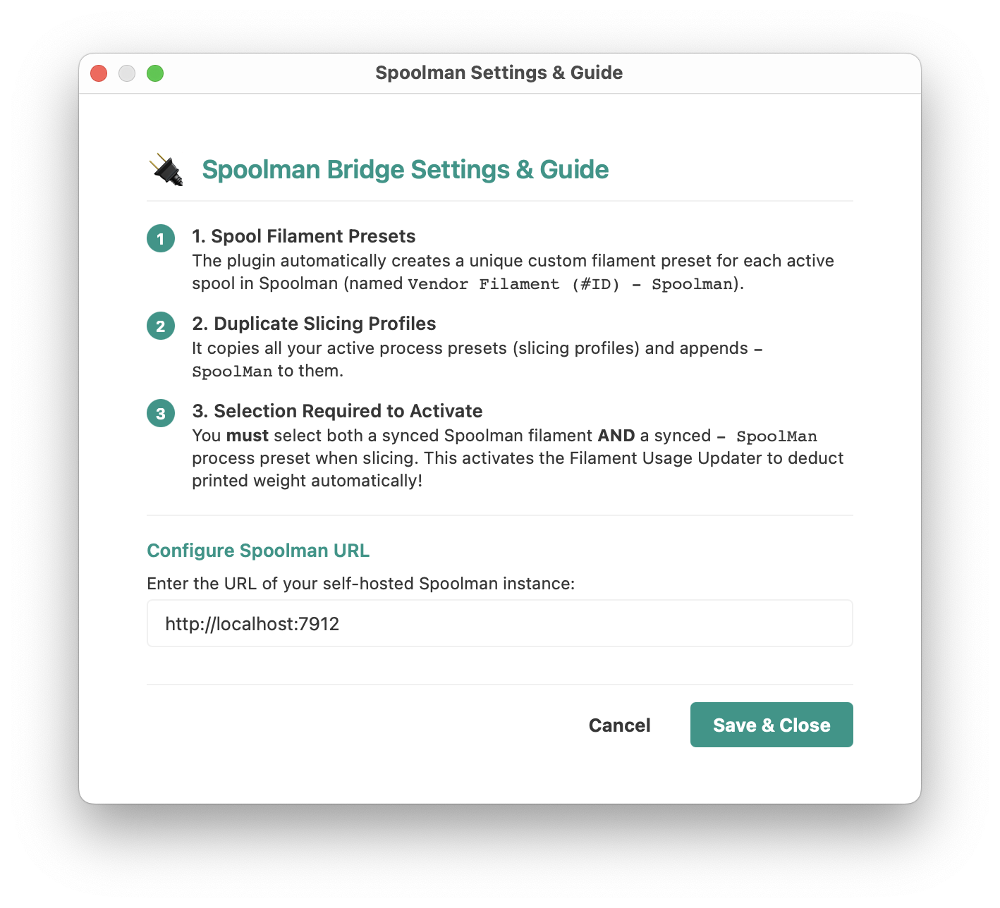
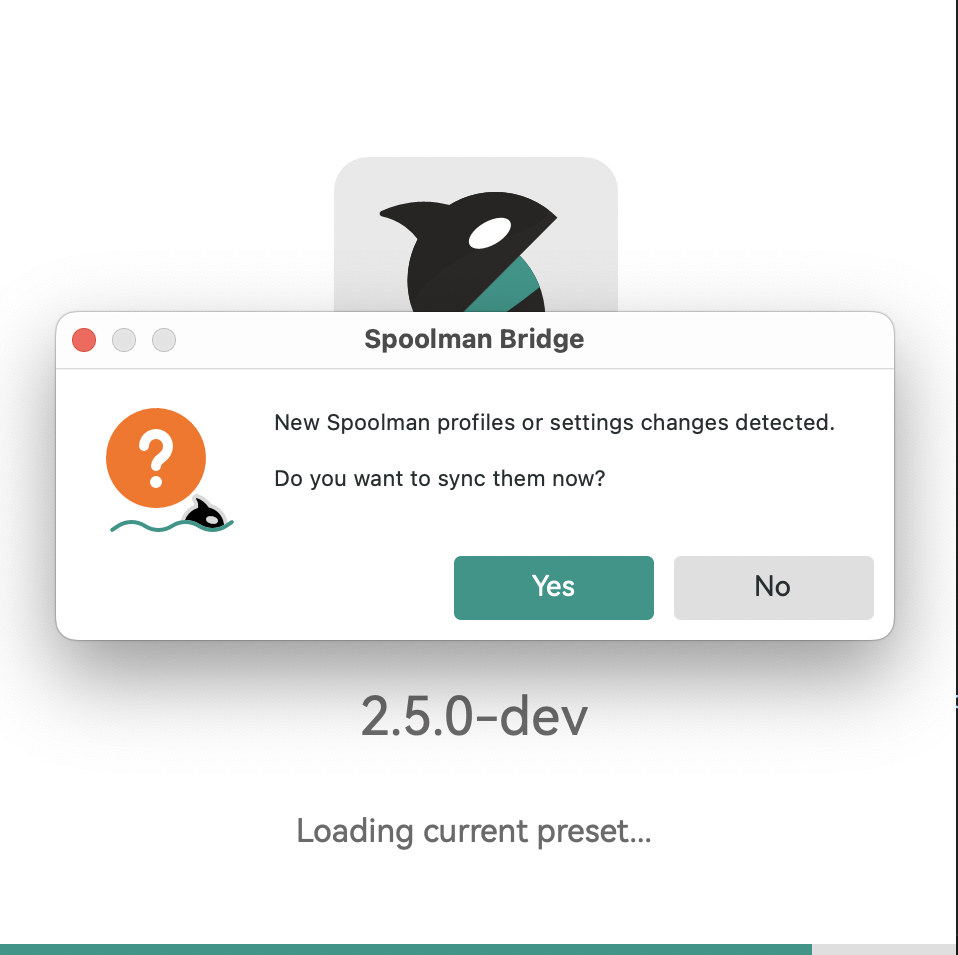
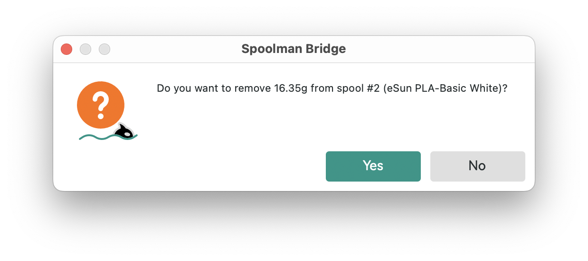

# OrcaSlicer Spoolman Bridge

  

An OrcaSlicer Python plugin integrating with [Spoolman](https://github.com/Donkie/Spoolman/), a universal self-hosted filament inventory manager.

## Table of Contents

- [Features](#features)
- [How It Works](#how-it-works)
- [Installation](#installation)
- [Configuration & Usage](#configuration--usage)
- [License](#license)

## Features

- [x] **Universal Spoolman Integration**: Connects to your local or hosted Spoolman API instance.
- [x] **Automatic Presets Synchronization**: Imports active Spoolman spools as custom filament profiles.
- [x] **Duplicated Slicing Profiles**: Automatically duplicates your slicing processes and binds the plugin pipeline to them.
- [x] **Smart Preset Merging**: Modifying settings in the OrcaSlicer UI (retraction, volumetric limits, fan overrides) is preserved and never overwritten by subsequent synchronizations.
- [x] **Onboarding & Unified Setup**: Integrated interactive setup wizard explaining the plugin workflows.
- [x] **API Status Validation**: Validates connections automatically, prompting configuration adjustments if offline.
- [x] **G-Code Filament Deduction**: Automatically extracts printed filament consumption weight and prompts for Spoolman subtraction on export/print.

## How It Works

1. **Spool Filament Presets**: For every active spool in Spoolman, the bridge creates a custom user filament preset formatted as `Vendor FilamentName (#ID) - Spoolman` (e.g. `eSun PLA-Basic White (#2) - Spoolman`).
   
   
2. **Duplicated Slicing Profiles**: The bridge copies all your active process presets (slicing profiles) and appends `- SpoolMan` to their names.
   
   
3. **Activation**: Slicing requires selecting **both** a synced Spoolman filament preset **AND** a synced `- SpoolMan` process preset. Slicing with both active registers the capability and triggers the automatic weight deduction wizard upon G-code export/print.
   
   

## Installation

To install the plugin, download the built `.whl` (wheel) package file and place it in a subdirectory inside OrcaSlicer's plugins folder.

### macOS
1. Open terminal and navigate to your OrcaSlicer plugins directory:
   `cd ~/Library/Application\ Support/OrcaSlicer/orca_plugins`
2. Create a folder for the plugin:
   `mkdir -p orcaslicer_plugin_spoolman`
3. Copy the built `orcaslicer_plugin_spoolman-1.0.0-py3-none-any.whl` file into that folder.
4. Restart OrcaSlicer.

### Windows
1. Open File Explorer and navigate to:
   `%APPDATA%\OrcaSlicer\orca_plugins`
2. Create a folder named `orcaslicer_plugin_spoolman`.
3. Copy the built `orcaslicer_plugin_spoolman-1.0.0-py3-none-any.whl` file into that folder.
4. Restart OrcaSlicer.

## Configuration & Usage

1. **Guide & URL Setup**: Upon first launch (or by selecting **Plugins > Spoolman Settings & Guide**), a dialog window will guide you through setup and prompt you to input your self-hosted Spoolman server URL (e.g., `http://localhost:7912`).
   
   
2. **Synchronization**: Run **Plugins > Sync Spoolman Profiles** to query Spoolman and populate OrcaSlicer's user directory.
   
   
3. **Weight Deduction**: Assign the synced filament profile and process profile, slice, and export your G-code. A prompt will ask you to confirm the filament consumption weight to deduct it from the active Spoolman spool.
   

## License

This project is licensed under the MIT License - see the LICENSE file for details.
